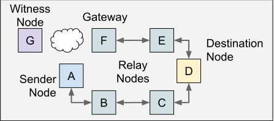
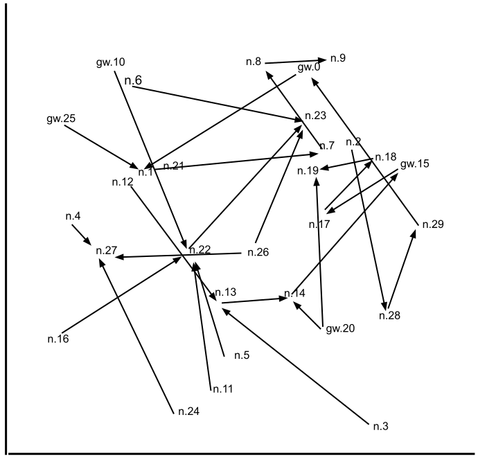

# Lot49 

## Motivation

> "I’m interested in how the blockchain has shown you can build a protocol that incents the use of the protocol itself."
> 
> -- [Daniela Perdomo, goTenna Forum](https://community.gotennamesh.com/t/gotenna-mesh-and-blockchain-potential-applications-and-integrations/145/5)

The goal of the Lot49 project is to use concepts and technology developed for decentralized value transfer protocols to solve similar problems that exist for adhoc mesh communication protocols. From Daniela's forum post:

* ZERO-START: How do we incent the use of our mesh network before it’s reached critical mass to become generally useful at scale?
* COVERAGE: How do we incent people to put up as many nodes as possible?
* CAPACITY: How do we incent people to put up more nodes in areas that need to handle higher volumes of traffic?
* POWER: How do we incent the sharing of energy resources?
* SPECTRUM: How do we communally incent fair use in a decentralized system running on limited spectrum?
* LOCAL V. GLOBAL: How do we incent people to build bridges between mesh networks?
* NETWORK INTEGRITY: How do we incent & validate integrity in a mostly off-grid, entirely mobile mesh network?

This project is a high-level simulation that explores one possible approach to address these questions. The proposed Lot49 protocol is a modified version of the [Bitcoin Lightning Network](https://en.wikipedia.org/wiki/Lightning_Network) protocol adapted to operate more efficiently within the communication constraints of a mobile mesh radio network. In particular, Lot49 adopts changes to the Lightning protocol to reduce the amount of data exchanged between off-grid nodes and to reduce the amount of data that must be sent through internet gateways to confirm transactions. 

To reduce the amount of data exchanged between nodes we use a less interactive state update mechanism. To reduce the amount of data settled on the blockchain through internet gateways we use an aggregate signature scheme to combine transactions. Specifically, this simulation assumes the [eltoo](https://blockstream.com/eltoo.pdf) update mechanism and non-interactive BLS signature aggregation. Different combinations of update mechanism/signature scheme such as the current Poon-Dryja/ECDSA, eltoo/Schnorr and eltoo/BLS are examined [here](doc/transmission_overhead.md).

## Protocol Simulation Summary

* Sender nodes using source routing to send message data (think SMS, not TCP/IP) to destination nodes.
* Sender nodes commit to a payment to the destination node if routing via relay nodes or internet gateway nodes.
* Nodes that relay data for a sender node collect a relay fee only if the destination node receives the message data.
* Payment transactions are verified and settled on a decentralized ledger using online witness nodes via an internet gateway node.
* Simulated nodes move randomly and send message data to a correspondent node.
* Some percent of nodes also act as internet gateways.
* Sender nodes commits to a payment by including their signature in an incentive header.
* An incentive header is included with the message data rebroadcast by each relay or gateway node.
* A destination nodes receives the remaining value not claimed as fees by the relay nodes (like a normal LN payment).
* HTLCs for a message delivery are conditioned on the aggregate signature containing valid signatures from:
  * a sender node that commits the initial value to be sent
  * a destination node signing the message data (instead of revealing a hash preimage)
  * relay nodes that commit value to the next relay hop or destination node
* After the destination node signs the incentive header it can be presented as proof to upstream relays to update their channels.
* Any node can settle the entire chain of payments with a single validly signed incentive header.
* Public keys are preshared, cached and referenced in routes and incentive headers by a short ID.

note: Node A is within radio range of Node B, but must relay data to Node D via Nodes B and C.

## Mesh Radio Network Specifications

* Message Size - up to 236 bytes per message
* Data Rate - 5 messages per minute
* Range - 1600 meters

## Fixed Simulation Parameters

* Simulation Rate - 1 update per minute
* Message Size - size of payload messages (excluding headers) (200 bytes)
* Area - size of mesh area (5 x 5 km)
* ID size - size of node ID (2 bytes)
* Incentive Header Overhead - 4 bytes + relay path + signature (see below)
* Message Hash - size of message hash (32 bytes)
* Relay Incentive - how likely a node is to relay without incentives (0%, incentives only)
* Send Incentive - how likely a node is to send a message with an incentive (100%)
* Broadcast Success - per broadcast chance of delivery success for message sent from node A * to B based on distance and local node density (100% if in radio range, otherwise won’t send)
* Correspondents - number of other nodes to communicate with (1 other node for each node in the simulation, always next node numerically)
* Duration - how long to run the simulation with the same set of peers and correspondents. (up to 120 minutes)
* Channel Size - default channel starting number of tokens (2000 tokens)
* Relay Cost - default number of tokens taken per relay (1 token)
* Prepaid Cost - default number of tokens prepaid to send a message (# of hops + 1 token)
* Setup Failure - chance a channel setup transaction is not valid, ie. double spent (0%)
* Pause Time - how long will nodes pause once they have reached their random waypoint (5 minutes).
* Radio Range - successful radio broadcast distance (1600 meters)
* Count Single Hop Correspondents: No, only when originated message is sent via a relay.
* Speed - speed that nodes move (85 meters per minute - walking pace)

## Variable simulation parameters

* Density - average number of nodes per square meter (0.5, 1, 2 or 3 node per sq km)
* Signature Size - size of aggregate signature (32, 48 or 64 bytes)
* Gateways - percent of nodes acting as gateways
* Witness Channel Setup - confirm new channel setup transactions immediately vs. deferred confirmation

## FAQ

Q: Can Lot49 use the current Bitcoin network to settle payment transactions?

A: Not currently because eltoo and signature aggregation are not possible. Bitcoin does not support [SIGHASH_NOINPUT](https://github.com/bitcoin/bips/blob/master/bip-0118.mediawiki) which is required for the [eltoo](https://blockstream.com/eltoo.pdf) update scheme. Also, Bitcoin currently only supports ECDSA signatures which can not be non-interactively aggregated like [BLS signatures](https://crypto.stanford.edu/~dabo/pubs/papers/aggreg.pdf) can.

Q: Are there any alternatives to using BLS signatures and non-interactive signature aggregation?

A: It may be possible to use [Schnorr based Multisignatures](https://eprint.iacr.org/2018/068.pdf) to accomplish nearly the same level of overhead reduction when settling transaction chains as the more general BLS signature aggregation.

Q: Why use eltoo and not use the Poon-Dryja channel state update scheme currently used by the Lightning Network?

A: The current Lightning Network channel state update mechanism requires both parties hold different HTLC contracts and old states must be revoked before a new state is valid. This requires 1.5 round trip communications between the nodes, as follows:

* Node A signs a new HTLC to commit a payment to Node B
* Node B signs a new HTLC and revokes their previous HTLC with Node A 
* Node A revokes their previous HTLC with Node B

Using eltoo both nodes use the same HTLC and there is no penalty if a node settles an out-of-date HTLC. This means that a single commitment from the payment sender is enough to provisionally update a channel. For example:

* Node A signs a new HTLC with different (xPub derived) settlement public keys to commit to a payment to Node B.
  
Note: eltoo uses symetric HTLC transactions so Node B does not need to wait for Node A to revoke the previous channel state; if Node B gets the HTLC preimage then they have all the information they need to safely settle the transaction. Node A can also safely settle the previous channel state even if they don't have a commitment to the new state and revocation of the old state from Node B. Node B can not penalize Node A for dropping an out-of-date transaction to the blockchain.

## Simulation Code

The current state of the code is rough, lightly documented and still in flux. The code currently simulates the exchange of message data and incentive heades between randomly moving nodes. It also reconstitutes mock transactions from incentive headers and simulates settling them on a blockchain.

Dependency:
* [bls-signature library](https://github.com/Chia-Network/bls-signatures) to create non-interactive aggregate signatures.

## Analysis

 I am currently analyzing the output data written to the 'results' directory to evaluate the total incentive header overhead broadcast on the mesh network. I am also investigating the token balances of different nodes to see how they evolve over time.

## Future

This is a single threaded simulation and I would like to be able to account for nodes forwarding data asynchronously for many nodes. To reconstruct transactions for other mesh nodes they need to know the state of other node's channels; this is not currently simulated accurately. Ultimately valid testnet transactions should be created and verified using a real blockchain. Testing using more detailed communication simulations, or real hardware, is also on the roadmap.
